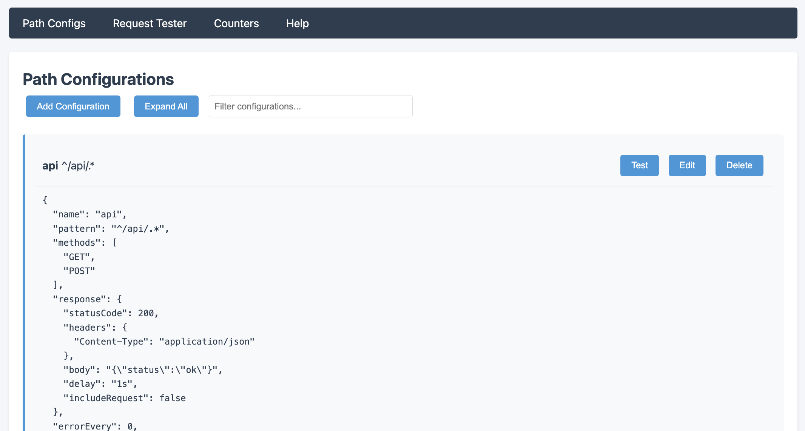
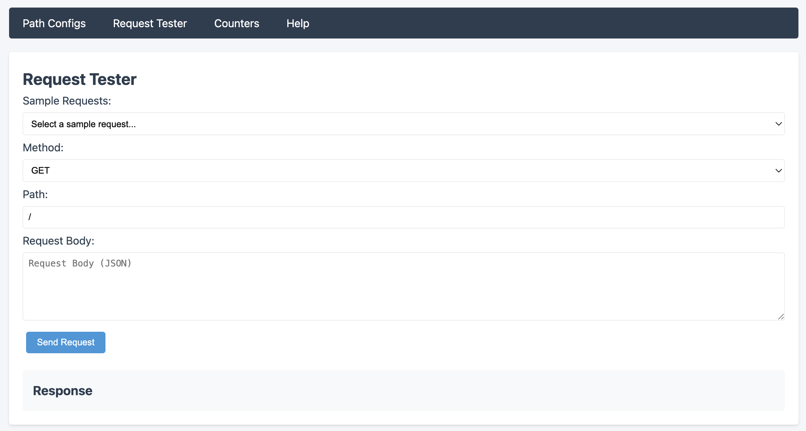
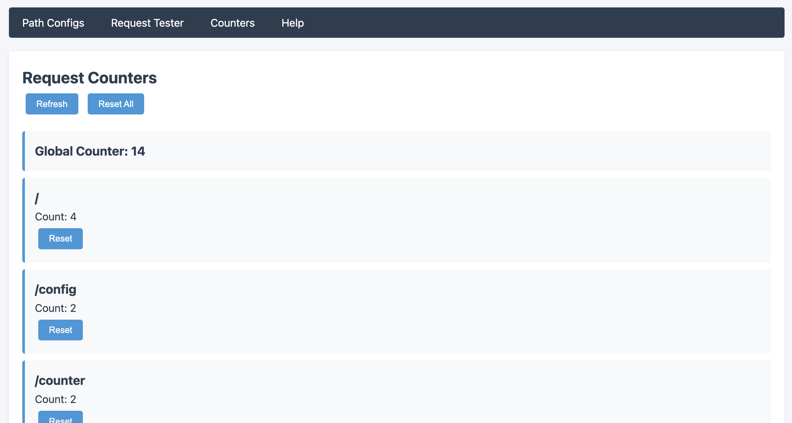
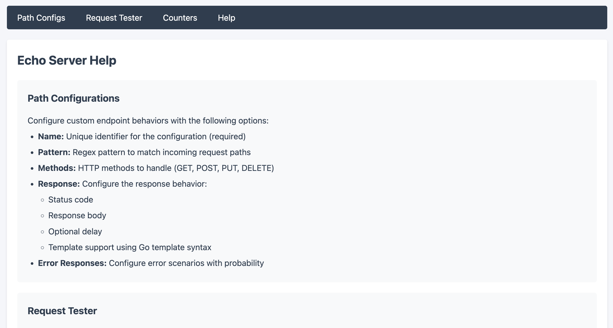

# Echo Server

A configurable HTTP echo server with advanced features for testing and mocking HTTP endpoints.

## Features

- Request echoing with detailed request information
- Path-based configuration with regex support
- Request counting (global and per-path)
- Customizable responses (status codes, headers, body)
- Configurable response delays
- Error injection capabilities
- Thread-safe operations
- REST API for configuration management
- Proxy support for upstream servers
- Web UI for configuration and testing
- Record and retrieve request/response history with UI integration.

## Screenshots

### Path Configurations

Configure and manage endpoint behaviors with regex pattern matching, methods, and responses.

### Request Tester

Test endpoints with custom methods, paths, and request bodies.

### Request Counters

Monitor request counts per endpoint and manage counters.

### Help Documentation

Built-in documentation and configuration examples.

## Installation

```bash
go get github.com/yourusername/echo-server
```

## Quick Start

1. Run the server:
```bash
go run cmd/server/main.go
```

2. Access the web UI:
```
http://localhost:8080
```

3. Make a test request:
```bash
curl http://localhost:8080/test
```

## Configuration

### Server Configuration

Create a `config/server.json` file:

```json
{
    "host": "localhost",
    "port": 8080,
    "readTimeout": "30s",
    "writeTimeout": "30s",
    "defaultResponse": {
        "statusCode": 200,
        "headers": {
            "Content-Type": "application/json"
        }
    }
}
```

### Path Configuration

Create path configurations in `config/paths/`:

```json
{
    "name": "api",
    "pattern": "^/api/.*",
    "methods": ["GET", "POST"],
    "response": {
        "statusCode": 200,
        "headers": {
            "Content-Type": "application/json"
        },
        "body": "{\"status\":\"ok\"}",
        "delay": "100ms"
    },
    "errorResponse": {
        "statusCode": 500,
        "body": "{\"error\":\"internal server error\"}"
    },
    "errorEvery": 5,
    "counterEnabled": true
}
```

### Proxy Configuration

Configure proxy settings for specific paths:

```json
{
    "name": "proxy-endpoint",
    "pattern": "^/proxy/.*",
    "methods": ["GET", "POST", "PUT", "DELETE"],
    "proxy": {
        "url": "http://upstream-api.example.com",
        "timeout": "30s",
        "stripPrefix": true,
        "preserveHost": false,
        "allowedHeaders": ["Authorization", "Content-Type"],
        "forwardHeaders": ["X-Request-ID"]
    }
}
```

## API Endpoints

### Configuration Management

- `GET /config/paths` - List all path configurations
- `POST /config/paths` - Add new path configuration
- `PUT /config/paths/{pattern}` - Update existing path configuration

### Counter Management

- `GET /counter` - Get all counters
- `DELETE /counter/{path}` - Reset counter for specific path
- `DELETE /counter` - Reset all counters

## Advanced Features

### Response Templating

Use Go templates in response bodies:

```json
{
    "body": "template:{\"path\":\"{{.Path}}\",\"method\":\"{{.Method}}\"}"
}
```

### Error Injection

Configure error responses with frequency:

```json
{
    "errorResponse": {
        "statusCode": 500,
        "body": "{\"error\":\"random error\"}"
    },
    "errorFrequency": 0.1
}
```

### Request Counting

Enable request counting per path:

```json
{
    "counterEnabled": true
}
```

## Command Line Options

```
Usage:
  echo-server [options]

Options:
  -port int
        Port to run the server on (default 8080)
  -config string
        Path to configuration directory (default "./config")
  -upstream string
        Upstream server URL to proxy requests to
  -proxy-timeout duration
        Timeout for proxy requests (default 30s)
  -help
        Show this help message
```

## Project Structure

```
echo-server/
├── cmd/
│   └── server/
│       └── main.go
├── config/
│   ├── server.json
│   └── paths/
├── internal/
│   ├── config/
│   ├── counter/
│   ├── handler/
│   ├── matcher/
│   ├── middleware/
│   └── model/
├── pkg/
│   └── logger/
└── README.md
```

## Contributing

1. Fork the repository
2. Create your feature branch
3. Commit your changes
4. Push to the branch
5. Create a new Pull Request

## License

This project is licensed under the MIT License - see the LICENSE file for details.